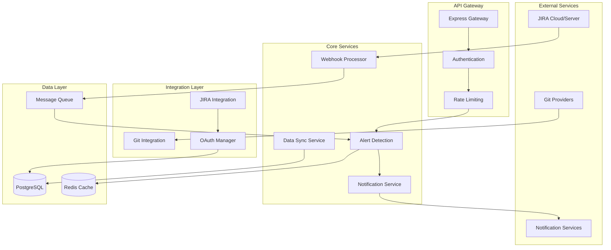

# 🏗️ System Architecture

The **JIRA Sprint Intelligence Alert System (SIAS)** is designed as a scalable, event-driven microservices architecture that provides real-time sprint monitoring with intelligent alerting capabilities.

## 📋 Table of Contents

- [System Overview](#system-overview)
- [Architecture Patterns](#architecture-patterns)
- [Component Diagram](#component-diagram)
- [Data Flow](#data-flow)
- [Technology Stack](#technology-stack)
- [Security Architecture](#security-architecture)
- [Scalability Considerations](#scalability-considerations)

## 🎯 System Overview

SIAS monitors JIRA sprints in real-time, detects potential issues using configurable rules, and delivers proactive alerts through multiple channels. The system emphasizes reliability, performance, and extensibility.

### Core Capabilities
- **Real-time Monitoring**: Webhook-driven event processing
- **Intelligent Alerting**: Rule-based detection with ML insights
- **Multi-tenant Architecture**: Organization-based data isolation
- **Integration Ecosystem**: JIRA, Git providers, notification channels
- **Performance Optimization**: Caching, queuing, and batch processing

## 🏛️ Architecture Patterns

### **1. Layered Architecture**
```
┌─────────────────────────────────────────┐
│            Presentation Layer           │ ← HTTP Controllers, Routes
├─────────────────────────────────────────┤
│             Business Layer              │ ← Services, Alert Detection
├─────────────────────────────────────────┤
│            Integration Layer            │ ← JIRA, Git, Notifications
├─────────────────────────────────────────┤
│               Data Layer                │ ← Database, Cache, Queue
└─────────────────────────────────────────┘
```

### **2. Event-Driven Architecture**
- **Webhook Processing**: Asynchronous event handling
- **Queue-Based Reliability**: Message queuing with retry logic
- **Circuit Breaker Pattern**: External service resilience
- **Observer Pattern**: Real-time notification triggering

### **3. Service-Oriented Design**
- **Dependency Injection**: Service container pattern
- **Interface Segregation**: Clean service boundaries
- **Single Responsibility**: Focused service functions
- **Inversion of Control**: Testable, maintainable code

## 📊 Component Diagram



## 🔄 Data Flow

### **1. Webhook Event Processing**
```
JIRA Event → Webhook Handler → Signature Validation → Event Queue → 
Alert Detection → Rule Evaluation → Notification Queue → Channel Delivery
```

### **2. Alert Detection Flow**
```
Issue Change → Field Analysis → Rule Matching → Threshold Check → 
Alert Creation → Metadata Enrichment → Notification Trigger
```

### **3. OAuth Integration Flow**
```
User Request → OAuth Redirect → Code Exchange → Token Storage → 
API Client Creation → Resource Access → Token Refresh (as needed)
```

## 🛠️ Technology Stack

### **Runtime & Framework**
- **Node.js 18+**: JavaScript runtime with ES2022 support
- **TypeScript 5.8**: Type-safe development with strict mode
- **Express.js**: Web framework with comprehensive middleware
- **Joi**: Schema validation and sanitization

### **Data Storage**
- **PostgreSQL 14+**: Primary database with advanced features
  - Table partitioning for large datasets
  - Comprehensive indexing strategy
  - Custom types and triggers
  - ACID compliance for data integrity
- **Redis 6+**: Caching and session management
  - Distributed caching layer
  - Pub/sub messaging
  - Queue processing with Bull

### **Security & Authentication**
- **JWT**: Stateless authentication with refresh tokens
- **OAuth 2.0**: External service integration (JIRA, Git)
- **RBAC**: Role-based access control
- **Helmet.js**: Security headers and protection
- **CORS**: Cross-origin resource sharing
- **Rate Limiting**: Request throttling and DDoS protection

### **Monitoring & Logging**
- **Winston**: Structured logging with multiple transports
- **Performance Tracking**: Request/response timing
- **Health Checks**: Service monitoring and diagnostics
- **Error Aggregation**: Centralized error handling

### **Development Tools**
- **ESLint + Prettier**: Code quality and formatting
- **Jest**: Testing framework with coverage reporting
- **TypeScript Path Mapping**: Clean import statements
- **Docker**: Containerization for consistent deployment

## 🔒 Security Architecture

### **Authentication Flow**
```
Client Request → JWT Validation → User Context → RBAC Check → 
Resource Access → Audit Logging
```

### **API Security Layers**
1. **HTTPS Enforcement**: TLS 1.3 encryption
2. **CORS Policy**: Restricted origin access
3. **Rate Limiting**: Request throttling by IP/user
4. **Input Validation**: Joi schema validation
5. **SQL Injection Prevention**: Parameterized queries
6. **XSS Protection**: Content Security Policy
7. **Authentication**: JWT with secure storage
8. **Authorization**: Role-based access control

### **Data Protection**
- **Encryption at Rest**: Database and file encryption
- **Secure Token Storage**: Redis with TTL expiration
- **Sensitive Data Masking**: Log sanitization
- **API Key Management**: Environment-based configuration
- **Webhook Signature Verification**: HMAC-SHA256 validation

## 📈 Scalability Considerations

### **Horizontal Scaling**
- **Stateless Services**: No server-side session storage
- **Load Balancer Ready**: Health check endpoints
- **Database Connection Pooling**: Efficient resource usage
- **Redis Clustering**: Distributed caching
- **Message Queue Partitioning**: Parallel processing

### **Performance Optimization**
- **Caching Strategy**: Multi-level caching (Redis, application)
- **Database Indexing**: Query optimization
- **Batch Processing**: Bulk operations for efficiency
- **Lazy Loading**: On-demand resource loading
- **Circuit Breaker**: External service fault tolerance

### **Monitoring & Observability**
- **Structured Logging**: JSON-formatted logs
- **Metrics Collection**: Performance indicators
- **Distributed Tracing**: Request correlation
- **Health Monitoring**: Service dependency checks
- **Alerting**: System health notifications

## 🚀 Deployment Architecture

### **Container Strategy**
```
┌─────────────────┐  ┌─────────────────┐  ┌─────────────────┐
│   Load Balancer │  │   App Instance  │  │   App Instance  │
│    (nginx)      │  │   (Node.js)     │  │   (Node.js)     │
└─────────────────┘  └─────────────────┘  └─────────────────┘
         │                     │                     │
         └─────────────────────┼─────────────────────┘
                              │
         ┌─────────────────────┼─────────────────────┐
         │                    │                     │
┌─────────────────┐  ┌─────────────────┐  ┌─────────────────┐
│   PostgreSQL    │  │     Redis       │  │   File Storage  │
│   (Primary)     │  │   (Cache/Queue) │  │     (S3)        │
└─────────────────┘  └─────────────────┘  └─────────────────┘
```

### **Environment Configuration**
- **Development**: Single container, local database
- **Staging**: Multi-container, shared resources
- **Production**: Clustered deployment, managed services

## 🔗 Integration Points

### **External Service Dependencies**
- **JIRA API**: Issue data and webhook events
- **Git Providers**: Code commit and PR information
- **Notification Services**: Email, Slack, Teams delivery
- **File Storage**: Visualization and report storage

### **Internal Service Communication**
- **Service Container**: Dependency injection and lifecycle
- **Event Bus**: Internal event propagation
- **Database Layer**: Unified data access patterns
- **Cache Layer**: Performance optimization

---

**Related Documentation**:
- [Getting Started Guide](./guides/GETTING_STARTED.md) - Setup instructions
- [API Reference](./API.md) - Complete API documentation
- [Database Design](./modules/database.md) - Schema and data modeling
- [JIRA Integration](./modules/jira-integration.md) - External service integration