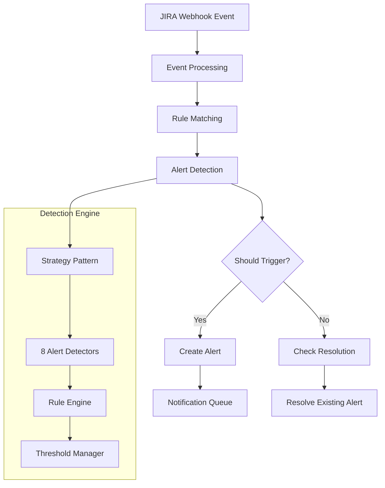
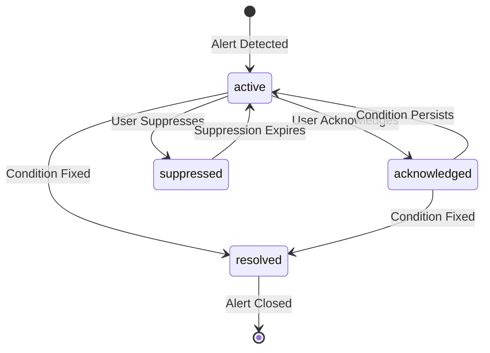

# 🚨 Alert Detection Engine

Comprehensive documentation for the alert detection engine, the core component responsible for monitoring JIRA sprints and generating intelligent alerts based on configurable rules.

## 📋 Table of Contents

- [Overview](#overview)
- [Alert Types](#alert-types)
- [Detection Engine](#detection-engine)
- [Rule Configuration](#rule-configuration)
- [Alert Lifecycle](#alert-lifecycle)
- [Performance Optimization](#performance-optimization)
- [Custom Detectors](#custom-detectors)
- [Monitoring & Metrics](#monitoring--metrics)

## 🎯 Overview

The Alert Detection Engine is a sophisticated rule-based system that monitors JIRA issues and sprints in real-time, detecting potential problems before they impact sprint goals. The engine uses a strategy pattern to implement different alert types, each with configurable thresholds and conditions.

### Key Features

- **Real-time Processing**: Immediate detection on JIRA webhook events
- **8 Alert Types**: Comprehensive coverage of sprint intelligence scenarios
- **Configurable Rules**: Organization-specific thresholds and conditions
- **Multi-tenant Support**: Isolated rules and data per organization
- **Performance Optimized**: Caching, batch processing, and efficient queries

### Architecture



## 🏷️ Alert Types

The system supports 8 core alert types, each targeting specific sprint intelligence scenarios:

### 1. Missing Estimate (`missing_estimate`)

**Purpose**: Detect issues without time estimates or story points after a configured threshold.

**When Triggered**:
- Issue created without estimate (timeoriginalestimate or story points)
- Configurable threshold (default: 24 hours after creation)
- Applies to specific issue types, projects, or statuses

**Configuration Example**:
```typescript
{
  alertType: 'missing_estimate',
  severity: 'medium',
  conditions: {
    projectKeys: ['PROJ', 'TEST'],
    issueTypes: ['Story', 'Bug'],
    statuses: ['To Do', 'In Progress']
  },
  thresholds: {
    estimateRequiredAfterHours: 24,
    minStoryPointsForEstimate: 1
  },
  filters: {
    excludeLabels: ['spike', 'research']
  }
}
```

### 2. Missing Time Tracking (`missing_time_tracking`)

**Purpose**: Identify in-progress issues without logged time.

**When Triggered**:
- Issue in active status (In Progress, In Development, In Review)
- No time logged (timespent = 0 or null)
- Configurable threshold (default: 8 hours in active status)

**Implementation**:
```typescript
class MissingTimeTrackingDetector extends AlertDetector {
  async shouldTrigger(issue: JiraIssue, rule: AlertRule): Promise<boolean> {
    const inProgressStatuses = ['In Progress', 'In Development', 'In Review'];
    const isInProgress = inProgressStatuses.includes(issue.fields.status.name);
    
    if (!isInProgress) return false;

    const hasTimeLogged = issue.fields.timespent && issue.fields.timespent > 0;
    if (hasTimeLogged) return false;

    const threshold = rule.thresholds.timeTrackingRequiredAfterHours || 8;
    const updatedTime = new Date(issue.fields.updated).getTime();
    const thresholdTime = threshold * 60 * 60 * 1000;
    
    return Date.now() - updatedTime > thresholdTime;
  }
}
```

### 3. Missing Code (`missing_code`)

**Purpose**: Alert when issues in development have no linked code commits.

**When Triggered**:
- Issue in development status
- No linked commits found in connected Git repositories
- Configurable threshold (default: 12 hours in development)

**Git Integration**:
```typescript
// Checks for commits linked to issue
const hasLinkedCommits = await gitService.findCommitsByIssueKey(issue.key);
const hasBranchActivity = await gitService.findBranchesByIssueKey(issue.key);

return !hasLinkedCommits && !hasBranchActivity;
```

### 4. Missing PR (`missing_pr`)

**Purpose**: Detect code changes without corresponding pull requests.

**When Triggered**:
- Commits exist for issue
- No open or merged pull request found
- Issue approaching completion status

**Detection Logic**:
```typescript
const commits = await gitService.getCommitsByIssue(issue.key);
const pullRequests = await gitService.getPullRequestsByIssue(issue.key);

return commits.length > 0 && pullRequests.length === 0;
```

### 5. Unmerged PR (`unmerged_pr`)

**Purpose**: Highlight pull requests that remain unmerged near sprint end.

**When Triggered**:
- Open pull request exists
- Sprint end date approaching (configurable threshold)
- PR meets merge criteria (approved, CI passing)

### 6. Running Out of Time (`running_out_of_time`)

**Purpose**: Identify issues at risk of not completing before sprint end.

**When Triggered**:
- Sprint has defined end date
- Days remaining below threshold (default: 2 days)
- Issue not in completion status
- Remaining estimate exceeds available time

**Sprint-level Analysis**:
```typescript
async shouldTriggerSprint(issue: JiraIssue, sprint: JiraSprint, rule: AlertRule): Promise<boolean> {
  if (sprint.state !== 'active' || !sprint.endDate) return false;

  const endDate = new Date(sprint.endDate);
  const now = new Date();
  const timeRemaining = endDate.getTime() - now.getTime();
  const daysRemaining = timeRemaining / (1000 * 60 * 60 * 24);

  const threshold = rule.thresholds.sprintTimeRemainingDays || 2;
  return daysRemaining <= threshold && daysRemaining > 0;
}
```

### 7. Early Completion (`early_completion`)

**Purpose**: Detect issues completed significantly faster than estimated.

**When Triggered**:
- Issue transitioned to Done status
- Actual time spent is much less than original estimate
- Significant variance threshold (default: >50% under estimate)

**Learning Opportunity**:
```typescript
const originalEstimate = issue.fields.timeoriginalestimate || 0;
const timeSpent = issue.fields.timespent || 0;
const variance = (originalEstimate - timeSpent) / originalEstimate;

return variance > (rule.thresholds.earlyCompletionThresholdPercent || 0.5);
```

### 8. Unanswered Mention (`unanswered_mention`)

**Purpose**: Alert users when they're mentioned in comments without responding.

**When Triggered**:
- User mentioned in comment (@username)
- No response comment from mentioned user
- Configurable response time threshold (default: 4 hours)

**Mention Detection**:
```typescript
const mentionPattern = /@(\w+)/g;
const mentions = comment.body.match(mentionPattern);
const responseTimeout = rule.thresholds.mentionResponseTimeHours * 60 * 60 * 1000;

// Check for user response in subsequent comments
const hasResponse = await this.checkForUserResponse(issue, mentionedUser, comment.created);
```

## 🔧 Detection Engine

### Core Architecture

The detection engine uses the Strategy pattern to implement different alert types:

```typescript
export class AlertDetectionService extends BaseService {
  private detectors: Map<AlertType, AlertDetector> = new Map();
  private activeRules: Map<string, AlertRule[]> = new Map();

  async initialize(): Promise<void> {
    // Initialize all detectors
    this.detectors.set('missing_estimate', new MissingEstimateDetector());
    this.detectors.set('missing_time_tracking', new MissingTimeTrackingDetector());
    // ... other detectors
    
    // Load active rules from database
    await this.loadActiveRules();
  }
}
```

### Alert Detector Interface

All detectors implement the base `AlertDetector` interface:

```typescript
abstract class AlertDetector {
  abstract shouldTrigger(issue: JiraIssue, rule: AlertRule, changelog?: JiraChangeHistory): Promise<boolean>;
  abstract shouldResolve(issue: JiraIssue, rule: AlertRule): boolean;
  abstract generateTitle(issue: JiraIssue, rule: AlertRule): string;
  abstract generateDescription(issue: JiraIssue, rule: AlertRule): string;
  abstract generateMetadata(issue: JiraIssue, rule: AlertRule): Promise<AlertMetadata>;

  // Optional method for sprint-level detection
  async shouldTriggerSprint(issue: JiraIssue, sprint: JiraSprint, rule: AlertRule): Promise<boolean> {
    return false;
  }
}
```

### Processing Flow

```typescript
async processIssueAlerts(
  organizationId: string,
  issue: JiraIssue,
  changeType: 'created' | 'updated' | 'deleted',
  changelog?: JiraChangeHistory
): Promise<DetectedAlert[]> {
  const alerts: DetectedAlert[] = [];

  // Get active rules for organization
  const rules = this.activeRules.get(organizationId) || [];
  
  for (const rule of rules) {
    // Check if rule applies to this issue
    if (!this.doesRuleApplyToIssue(rule, issue)) continue;

    // Get detector for this alert type
    const detector = this.detectors.get(rule.alertType);
    if (!detector) continue;

    // Check if alert should be triggered
    const shouldTrigger = await detector.shouldTrigger(issue, rule, changelog);
    
    if (shouldTrigger) {
      // Check for existing active alert
      const existingAlert = await this.findActiveAlert(organizationId, rule.id, issue.id);
      
      if (!existingAlert) {
        // Create new alert
        const alert = await this.createAlert(organizationId, rule, issue, detector);
        alerts.push(alert);
      }
    }
  }

  return alerts;
}
```

## ⚙️ Rule Configuration

### Rule Structure

Alert rules define when and how alerts are triggered:

```typescript
interface AlertRule {
  id: string;
  organizationId: string;
  alertType: AlertType;
  isEnabled: boolean;
  severity: 'low' | 'medium' | 'high' | 'critical';
  conditions: AlertConditions;
  thresholds: AlertThresholds;
  filters: AlertFilters;
  notificationSettings: NotificationSettings;
}
```

### Conditions

Define which issues the rule applies to:

```typescript
interface AlertConditions {
  projectKeys?: string[];          // Specific projects
  issueTypes?: string[];           // Issue types (Story, Bug, Epic)
  statuses?: string[];             // Issue statuses
  assigneeIds?: string[];          // Specific assignees
  labels?: string[];               // Required labels  
  components?: string[];           // Issue components
  customFields?: Record<string, any>; // Custom field values
}
```

### Thresholds

Configurable numeric values that determine when alerts trigger:

```typescript
interface AlertThresholds {
  // Time-based thresholds (in hours)
  estimateRequiredAfterHours?: number;        // Default: 24
  timeTrackingRequiredAfterHours?: number;    // Default: 8
  mentionResponseTimeHours?: number;          // Default: 4
  codeCommitRequiredAfterHours?: number;      // Default: 12
  prRequiredAfterHours?: number;              // Default: 24
  prMergeReminderAfterHours?: number;         // Default: 48
  
  // Sprint-based thresholds
  sprintTimeRemainingDays?: number;           // Default: 2
  sprintProgressThresholdPercent?: number;    // Default: 0.8
  earlyCompletionThresholdPercent?: number;   // Default: 0.5
  
  // Story point thresholds
  minStoryPointsForEstimate?: number;         // Default: 1
  maxStoryPointsForAutoComplete?: number;     // Default: 13
  
  // Custom thresholds
  customThresholds?: Record<string, number>;
}
```

### Filters

Exclude specific issues from alert processing:

```typescript
interface AlertFilters {
  excludeStatuses?: string[];      // Don't process these statuses
  excludeIssueTypes?: string[];    // Don't process these issue types
  excludeLabels?: string[];        // Skip issues with these labels
  includeOnlyAssigned?: boolean;   // Only process assigned issues
  includeOnlyActiveSprints?: boolean; // Only active sprint issues
  workingDaysOnly?: boolean;       // Respect working days
  businessHoursOnly?: boolean;     // Respect working hours
}
```

### Example Rule Configuration

```typescript
const exampleRule: AlertRule = {
  id: 'rule_missing_estimates_proj',
  organizationId: 'org_123',
  alertType: 'missing_estimate',
  isEnabled: true,
  severity: 'medium',
  conditions: {
    projectKeys: ['PROJ', 'TEST'],
    issueTypes: ['Story', 'Bug'],
    statuses: ['To Do', 'In Progress']
  },
  thresholds: {
    estimateRequiredAfterHours: 24,
    minStoryPointsForEstimate: 1
  },
  filters: {
    excludeLabels: ['spike', 'research', 'investigation'],
    includeOnlyAssigned: true,
    workingDaysOnly: true
  },
  notificationSettings: {
    channels: ['email', 'slack'],
    frequency: 'immediate',
    quietHours: {
      enabled: true,
      startTime: '18:00',
      endTime: '09:00',
      timezone: 'America/New_York'
    }
  }
};
```

## 🔄 Alert Lifecycle

### Alert States

Alerts progress through defined states:

```typescript
type AlertStatus = 'active' | 'acknowledged' | 'resolved' | 'suppressed';
```

### State Transitions



### Lifecycle Management

```typescript
// Alert creation
const alert = await this.createAlert(organizationId, rule, issue, detector);

// User acknowledgment
await this.acknowledgeAlert(alert.id, userId, 'Working on estimate');

// Auto-resolution when condition fixes
if (detector.shouldResolve(issue, rule)) {
  await this.resolveAlert(alert.id, 'auto_resolved');
}

// Manual suppression
await this.suppressAlert(alert.id, userId, suppressionDuration);
```

### Alert Metadata

Each alert includes rich metadata for context:

```typescript
interface AlertMetadata {
  issueData: {
    summary: string;
    status: string;
    assignee?: string;
    reporter?: string;
    priority?: string;
    storyPoints?: number;
    timeEstimate?: number;
    timeSpent?: number;
    labels: string[];
    components: string[];
  };
  sprintData?: {
    name: string;
    state: string;
    startDate?: string;
    endDate?: string;
    daysRemaining?: number;
    progress?: number;
  };
  contextData: Record<string, any>;
  thresholds: AlertThresholds;
  triggerData: {
    field?: string;
    previousValue?: any;
    currentValue?: any;
    changeTime?: Date;
  };
}
```

## ⚡ Performance Optimization

### Caching Strategy

The detection engine implements multi-level caching:

```typescript
interface CachingStrategy {
  // Rule cache (Redis)
  activeRules: {
    key: `alert_rules:${organizationId}`,
    ttl: 300 // 5 minutes
  };
  
  // Issue cache (Redis)
  recentIssues: {
    key: `recent_issues:${organizationId}`,
    ttl: 60 // 1 minute
  };
  
  // Alert cache (Redis)
  activeAlerts: {
    key: `active_alerts:${organizationId}:${ruleId}:${issueId}`,
    ttl: 3600 // 1 hour
  };
}
```

### Batch Processing

Process multiple issues efficiently:

```typescript
async processBatchAlerts(
  organizationId: string,
  issues: JiraIssue[]
): Promise<DetectedAlert[]> {
  const batchSize = 50;
  const alerts: DetectedAlert[] = [];
  
  for (let i = 0; i < issues.length; i += batchSize) {
    const batch = issues.slice(i, i + batchSize);
    
    // Process batch in parallel
    const batchPromises = batch.map(issue => 
      this.processIssueAlerts(organizationId, issue, 'updated')
    );
    
    const batchResults = await Promise.all(batchPromises);
    alerts.push(...batchResults.flat());
    
    // Small delay to prevent overwhelming the system
    if (i + batchSize < issues.length) {
      await this.delay(100);
    }
  }
  
  return alerts;
}
```

### Query Optimization

Optimize database queries for rule matching:

```typescript
// Efficient rule loading with indexed queries
const rules = await query(`
  SELECT * FROM alert_rules 
  WHERE organization_id = $1 
    AND is_enabled = true 
    AND (conditions->>'projectKeys' IS NULL 
         OR conditions->>'projectKeys' @> $2::jsonb)
  ORDER BY severity DESC, created_at ASC
`, [organizationId, JSON.stringify([projectKey])]);

// Batch alert existence checks
const existingAlerts = await query(`
  SELECT rule_id, issue_id FROM alerts 
  WHERE organization_id = $1 
    AND status = 'active'
    AND issue_id = ANY($2::text[])
`, [organizationId, issueIds]);
```

## 🔨 Custom Detectors

### Creating Custom Detectors

Extend the base detector class for custom alert types:

```typescript
class CustomBusinessRuleDetector extends AlertDetector {
  async shouldTrigger(issue: JiraIssue, rule: AlertRule): Promise<boolean> {
    // Custom business logic
    const businessValue = issue.fields.customfield_business_value;
    const isHighValue = businessValue && businessValue > rule.thresholds.minBusinessValue;
    
    const isStalled = this.checkIfStalled(issue);
    
    return isHighValue && isStalled;
  }

  shouldResolve(issue: JiraIssue, rule: AlertRule): boolean {
    return !this.checkIfStalled(issue);
  }

  generateTitle(issue: JiraIssue, rule: AlertRule): string {
    return `High-Value Issue Stalled: ${issue.key}`;
  }

  generateDescription(issue: JiraIssue, rule: AlertRule): string {
    const businessValue = issue.fields.customfield_business_value;
    return `Issue ${issue.key} with business value ${businessValue} has been stalled for ${rule.thresholds.stalledDays} days.`;
  }

  async generateMetadata(issue: JiraIssue, rule: AlertRule): Promise<AlertMetadata> {
    return {
      issueData: {
        summary: issue.fields.summary,
        status: issue.fields.status.name,
        businessValue: issue.fields.customfield_business_value,
        // ... other fields
      },
      contextData: {
        stalledDays: this.calculateStalledDays(issue),
        lastActivity: this.getLastActivity(issue)
      },
      thresholds: rule.thresholds,
      triggerData: {
        field: 'status_change_time',
        currentValue: issue.fields.updated
      }
    };
  }

  private checkIfStalled(issue: JiraIssue): boolean {
    // Custom stalled logic
    const lastUpdate = new Date(issue.fields.updated);
    const stalledThreshold = 5 * 24 * 60 * 60 * 1000; // 5 days
    return Date.now() - lastUpdate.getTime() > stalledThreshold;
  }
}
```

### Registering Custom Detectors

```typescript
// Register custom detector
this.detectors.set('custom_business_rule', new CustomBusinessRuleDetector());

// Create corresponding rule
const customRule: AlertRule = {
  alertType: 'custom_business_rule',
  thresholds: {
    minBusinessValue: 100000,
    stalledDays: 5
  },
  // ... other configuration
};
```

## 📊 Monitoring & Metrics

### Alert Metrics

Track detection engine performance:

```typescript
interface AlertMetrics {
  // Processing metrics
  totalAlertsDetected: number;
  alertsByType: Record<AlertType, number>;
  alertsBySeverity: Record<string, number>;
  
  // Performance metrics
  averageProcessingTime: number;
  rulesEvaluated: number;
  detectorErrors: number;
  
  // Business metrics
  falsePositiveRate: number;
  alertResolutionTime: number;
  userEngagementRate: number;
}
```

### Health Monitoring

```typescript
// Detection engine health check
async checkHealth(): Promise<{
  status: 'healthy' | 'degraded' | 'unhealthy';
  metrics: AlertMetrics;
  errors: string[];
}> {
  const metrics = await this.collectMetrics();
  const errors: string[] = [];
  
  // Check error rates
  if (metrics.detectorErrors > 100) {
    errors.push('High detector error rate');
  }
  
  // Check processing performance
  if (metrics.averageProcessingTime > 5000) {
    errors.push('Slow processing performance');
  }
  
  const status = errors.length === 0 ? 'healthy' : 
                 errors.length < 3 ? 'degraded' : 'unhealthy';
  
  return { status, metrics, errors };
}
```

### Performance Tracking

```typescript
// Wrap detector execution with performance tracking
const processWithMetrics = async (detector: AlertDetector, issue: JiraIssue, rule: AlertRule) => {
  const startTime = process.hrtime.bigint();
  
  try {
    const result = await detector.shouldTrigger(issue, rule);
    
    const endTime = process.hrtime.bigint();
    const duration = Number(endTime - startTime) / 1000000; // Convert to milliseconds
    
    // Record metrics
    this.recordMetric('detector_execution_time', duration, {
      alertType: rule.alertType,
      organizationId: rule.organizationId
    });
    
    return result;
  } catch (error) {
    this.recordMetric('detector_error', 1, {
      alertType: rule.alertType,
      error: error.message
    });
    throw error;
  }
};
```

---

**Related Documentation**:
- [JIRA Integration](./jira-integration.md) - Event processing and data sync
- [API Reference](../API.md) - Alert management endpoints
- [Configuration Guide](../guides/CONFIGURATION.md) - Rule setup and tuning
- [Troubleshooting](../TROUBLESHOOTING.md) - Common alert issues