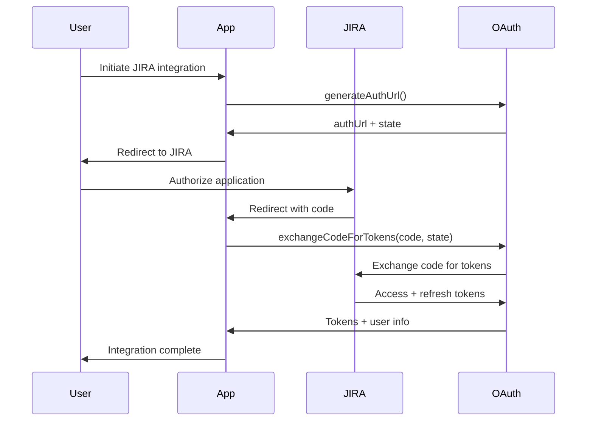
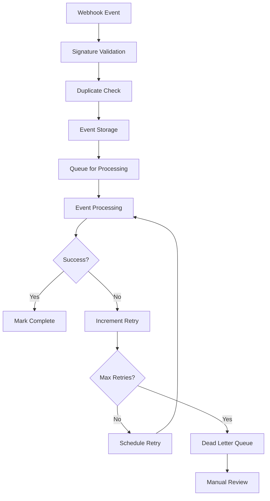

# 🔗 JIRA Integration Module

Complete documentation for the JIRA integration module, covering OAuth authentication, API client implementation, webhook processing, and data synchronization.

## 📋 Table of Contents

- [Overview](#overview)
- [OAuth 2.0 Authentication](#oauth-20-authentication)
- [API Client](#api-client)
- [Webhook Processing](#webhook-processing)
- [Service Integration](#service-integration)
- [Configuration](#configuration)
- [Error Handling](#error-handling)
- [Performance Optimization](#performance-optimization)

## 🎯 Overview

The JIRA integration module provides comprehensive connectivity with JIRA Cloud and Server instances through:

- **OAuth 2.0 with PKCE**: Secure authentication flow
- **REST API v3 Client**: Type-safe API wrapper with resilience patterns
- **Webhook Processing**: Real-time event handling with reliability
- **Data Synchronization**: Bi-directional data sync with conflict resolution

### Module Structure

```
src/integrations/jira/
├── oauth.ts           # OAuth 2.0 authentication service
├── client.ts          # REST API v3 client implementation
├── webhook.ts         # Webhook event processing
├── service.ts         # High-level integration service
└── ../types/jira.ts   # TypeScript type definitions
```

## 🔐 OAuth 2.0 Authentication

The OAuth service (`oauth.ts`) implements secure JIRA authentication using OAuth 2.0 with PKCE (Proof Key for Code Exchange).

### Key Features

- **PKCE Support**: Enhanced security for public clients
- **Token Management**: Automatic refresh and secure storage
- **Multi-Instance**: Support for multiple JIRA instances per organization
- **Error Recovery**: Robust error handling and retry logic

### Implementation Example

```typescript
import { JiraOAuthService } from '@/integrations/jira/oauth';

const oauthService = new JiraOAuthService();

// 1. Generate authorization URL
const { authUrl, state } = await oauthService.generateAuthUrl(
  'org_123',
  'user_456',
  'https://myapp.com/callback'
);

// Redirect user to authUrl...

// 2. Complete OAuth flow
const { tokens, organizationId, userId } = await oauthService.exchangeCodeForTokens(
  authorizationCode,
  state
);

// 3. Get accessible JIRA instances
const instances = await oauthService.getAccessibleResources(organizationId, userId);

// 4. Use tokens for API calls (automatic refresh)
const validTokens = await oauthService.getValidTokens(organizationId, userId);
```

### OAuth Flow Diagram



### Security Features

- **PKCE Implementation**: Code verifier and challenge generation
- **State Validation**: CSRF protection with time-based expiration
- **Secure Storage**: Encrypted token storage with TTL
- **Token Rotation**: Automatic refresh with fallback handling

## 🌐 API Client

The API client (`client.ts`) provides a comprehensive wrapper for JIRA REST API v3 with enterprise-grade reliability patterns.

### Architecture Features

- **Circuit Breaker**: Prevents cascade failures
- **Rate Limiting**: Respects JIRA API limits
- **Request Retry**: Exponential backoff for transient failures
- **Response Caching**: Intelligent caching with TTL
- **Type Safety**: Complete TypeScript coverage

### Usage Examples

```typescript
import { JiraApiClient } from '@/integrations/jira/client';

const client = new JiraApiClient({
  organizationId: 'org_123',
  userId: 'user_456',
  instanceId: 'instance_789'
});

// Test connection
const isConnected = await client.testConnection();

// Get projects
const projects = await client.getProjects(['description', 'lead']);

// Search issues with JQL
const searchResult = await client.searchIssues({
  jql: 'project = PROJ AND status = "In Progress"',
  fields: ['summary', 'status', 'assignee'],
  maxResults: 50
});

// Get sprint information
const sprints = await client.getBoardSprints(boardId, 'active');

// Add comment to issue
await client.addComment('PROJ-123', {
  body: {
    type: 'doc',
    version: 1,
    content: [
      {
        type: 'paragraph',
        content: [{ type: 'text', text: 'Status update from SIAS' }]
      }
    ]
  }
});
```

### Circuit Breaker Implementation

```typescript
interface CircuitBreakerState {
  failures: number;
  lastFailureTime: number;
  state: 'closed' | 'open' | 'half-open';
}

// Circuit breaker transitions
// closed -> open (after 5 failures)
// open -> half-open (after 1 minute timeout)
// half-open -> closed (on successful request)
// half-open -> open (on failed request)
```

### Request Interceptors

The client implements comprehensive request/response interceptors:

```typescript
// Request interceptor
- Authentication header injection
- Request ID generation for tracing
- Circuit breaker state checking
- Rate limit verification

// Response interceptor
- Rate limit header processing
- Circuit breaker state updates
- Error classification and retry logic
- Response caching with TTL
```

### Error Handling Strategy

| HTTP Status | Action | Retry | Circuit Breaker |
|-------------|--------|-------|-----------------|
| 401 | Refresh token once | No | No |
| 403 | Throw auth error | No | No |
| 404 | Throw not found | No | No |
| 429 | Wait for rate limit reset | No | No |
| 500-504 | Exponential backoff | Yes (3x) | Yes |
| Network | Exponential backoff | Yes (3x) | Yes |

## 🪝 Webhook Processing

The webhook service (`webhook.ts`) handles real-time JIRA events with enterprise-grade reliability and processing guarantees.

### Key Features

- **Signature Verification**: HMAC-SHA256 webhook validation
- **Event Deduplication**: Prevents duplicate processing
- **Queue-based Processing**: Asynchronous event handling
- **Retry Logic**: Exponential backoff with dead letter queue
- **Event Correlation**: Request tracing and audit logging

### Webhook Registration

```typescript
import { JiraWebhookService } from '@/integrations/jira/webhook';

const webhookService = new JiraWebhookService();

// Register webhook with JIRA
const webhookConfig = await webhookService.registerWebhook(
  'integration_123',
  [
    'jira:issue_created',
    'jira:issue_updated',
    'jira:issue_deleted',
    'comment_created',
    'worklog_created',
    'sprint_started',
    'sprint_closed'
  ],
  {
    projects: ['PROJ', 'TEST'],
    issueTypes: ['Story', 'Bug', 'Epic']
  }
);
```

### Event Processing Flow



### Supported Event Types

| Event Type | Description | Alert Triggers |
|------------|-------------|----------------|
| `jira:issue_created` | New issue created | Missing estimate detection |
| `jira:issue_updated` | Issue field changes | Status transition alerts |
| `jira:issue_deleted` | Issue removed | Alert cleanup |
| `comment_created` | New comment added | Mention detection |
| `comment_updated` | Comment modified | Mention detection |
| `worklog_created` | Time logged | Time tracking alerts |
| `worklog_updated` | Time log modified | Time tracking alerts |
| `sprint_started` | Sprint activated | Sprint monitoring setup |
| `sprint_closed` | Sprint completed | Sprint completion analysis |

### Processing Reliability

```typescript
interface ProcessingConfig {
  maxRetries: 5;
  retryDelays: [1000, 2000, 5000, 10000, 30000]; // Exponential backoff
  deadLetterQueueName: 'jira:webhook:dead-letter';
  eventQueueName: 'jira:webhook:events';
}

// Retry strategy
const scheduleRetry = async (eventId: string, retryCount: number) => {
  const delay = retryDelays[Math.min(retryCount - 1, retryDelays.length - 1)];
  
  await queue.add(eventQueueName, { eventId }, {
    delay,
    attempts: 1,
    removeOnComplete: 100,
    removeOnFail: 50
  });
};
```

## 🔧 Service Integration

The high-level service (`service.ts`) orchestrates OAuth, API client, and webhook processing into a cohesive integration layer.

### Service Architecture

```typescript
export class JiraIntegrationService extends BaseService {
  private oauthService: JiraOAuthService;
  private clientPool: Map<string, JiraApiClient>;
  
  // Integration lifecycle
  async setupIntegration(organizationId: string, userId: string): Promise<AuthResult>
  async completeOAuthFlow(code: string, state: string): Promise<IntegrationResult>
  
  // Data synchronization
  async syncIntegration(integrationId: string): Promise<SyncResult>
  async syncProjects(client: JiraApiClient, integration: Config): Promise<SyncStats>
  async syncSprints(client: JiraApiClient, integration: Config): Promise<SyncStats>
  async syncIssues(client: JiraApiClient, integration: Config): Promise<SyncStats>
  
  // Field discovery
  async discoverCustomFields(integrationId: string): Promise<FieldDiscovery>
  async updateFieldMappings(integrationId: string, mappings: FieldMappings): Promise<void>
}
```

### Integration Setup Process

```typescript
// 1. Setup integration
const { authUrl, state } = await jiraService.setupIntegration(
  'org_123',
  'user_456',
  'My JIRA Integration'
);

// 2. Complete OAuth (after user authorization)
const { integrationId, instances } = await jiraService.completeOAuthFlow(
  authorizationCode,
  state
);

// 3. Discover custom fields
const { fields, suggestions } = await jiraService.discoverCustomFields(integrationId);

// 4. Configure field mappings
await jiraService.updateFieldMappings(integrationId, {
  storyPoints: 'customfield_10001',
  epicLink: 'customfield_10002',
  sprint: 'customfield_10003'
});

// 5. Start initial sync
const syncResult = await jiraService.syncIntegration(integrationId);
```

### Data Synchronization Strategy

The service implements incremental synchronization with conflict resolution:

```typescript
interface SyncStrategy {
  // Full sync (initial setup)
  fullSync: {
    projects: 'all',
    sprints: 'last_6_months',
    issues: 'last_30_days'
  };
  
  // Incremental sync (ongoing)
  incrementalSync: {
    interval: '15_minutes',
    strategy: 'last_modified',
    batchSize: 100
  };
  
  // Conflict resolution
  conflictResolution: {
    strategy: 'jira_wins',
    logConflicts: true,
    notifyOnConflict: false
  };
}
```

## ⚙️ Configuration

### Environment Variables

```typescript
// Required JIRA integration settings
JIRA_CLIENT_ID=your_jira_client_id
JIRA_CLIENT_SECRET=your_jira_client_secret
JIRA_REDIRECT_URI=https://yourapp.com/integrations/jira/callback
JIRA_SCOPES=read:jira-user,read:jira-work,write:jira-work,manage:jira-webhook

// Optional settings
JIRA_DEFAULT_SYNC_INTERVAL=15         # Minutes
JIRA_MAX_RETRIES=3
JIRA_TIMEOUT=30000                    # Milliseconds
JIRA_CACHE_TTL=300                    # Seconds
```

### Integration Configuration

```typescript
interface JiraIntegrationConfig {
  id: string;
  organizationId: string;
  name: string;
  instanceId: string;
  baseUrl: string;
  isActive: boolean;
  settings: {
    syncInterval: number;               // Minutes
    enabledFeatures: string[];          // ['issues', 'sprints', 'comments']
    fieldMappings: Record<string, string>;
    projectFilters: string[];           // Project keys to sync
    sprintBoards: number[];             // Board IDs to monitor
  };
}
```

### Field Mapping Configuration

SIAS automatically discovers JIRA custom fields and suggests mappings:

```typescript
interface FieldMappingConfig {
  // Core field mappings
  storyPoints: string;        // Usually 'customfield_10001'
  epicLink: string;           // Usually 'customfield_10002'
  sprint: string;             // Usually 'customfield_10003'
  team: string;               // Custom team field
  
  // Time tracking fields
  originalEstimate: string;
  remainingEstimate: string;
  loggedTime: string;
  
  // Custom business fields
  severity: string;
  priority: string;
  businessValue: string;
}
```

## 🚨 Error Handling

### Error Classification

The integration module uses a hierarchical error system:

```typescript
// Base integration error
class JiraIntegrationError extends Error {
  constructor(message: string, cause?: Error) {
    super(message);
    this.name = 'JiraIntegrationError';
    this.cause = cause;
  }
}

// Authentication errors
class JiraAuthenticationError extends JiraIntegrationError {
  constructor(message: string, cause?: Error) {
    super(`JIRA Authentication Failed: ${message}`, cause);
    this.name = 'JiraAuthenticationError';
  }
}

// API errors
class JiraApiError extends JiraIntegrationError {
  constructor(
    message: string, 
    public statusCode?: number,
    public response?: any,
    cause?: Error
  ) {
    super(`JIRA API Error: ${message}`, cause);
    this.name = 'JiraApiError';
  }
}
```

### Error Recovery Strategies

| Error Type | Recovery Strategy | Retry | User Action |
|------------|------------------|-------|-------------|
| Token Expired | Auto-refresh token | Yes | None |
| Rate Limited | Wait for reset | Yes | None |
| Network Error | Exponential backoff | Yes | None |
| Auth Invalid | Clear tokens | No | Re-authenticate |
| Permission Denied | Log and alert | No | Check permissions |
| Instance Unavailable | Circuit breaker | Yes | Check JIRA status |

### Monitoring and Alerting

```typescript
// Error metrics collection
interface ErrorMetrics {
  totalErrors: number;
  errorsByType: Record<string, number>;
  errorsByEndpoint: Record<string, number>;
  circuitBreakerTrips: number;
  tokenRefreshFailures: number;
  webhookProcessingFailures: number;
}

// Health check indicators
interface HealthIndicators {
  oauthService: 'healthy' | 'degraded' | 'down';
  apiClient: 'healthy' | 'degraded' | 'down';
  webhookProcessor: 'healthy' | 'degraded' | 'down';
  lastSuccessfulSync: Date;
  queueDepth: number;
  errorRate: number;
}
```

## ⚡ Performance Optimization

### Caching Strategy

The integration implements multi-level caching:

```typescript
interface CachingConfig {
  // Application-level cache (Redis)
  appCache: {
    projects: { ttl: 600 },          // 10 minutes
    issueTypes: { ttl: 3600 },       // 1 hour
    statuses: { ttl: 3600 },         // 1 hour
    priorities: { ttl: 3600 },       // 1 hour
    customFields: { ttl: 3600 },     // 1 hour
    users: { ttl: 300 },             // 5 minutes
  };
  
  // HTTP-level cache (client)
  httpCache: {
    issues: { ttl: 60 },             // 1 minute
    sprints: { ttl: 300 },           // 5 minutes
    comments: { ttl: 0 },            // No cache
    worklogs: { ttl: 0 },            // No cache
  };
}
```

### Connection Pooling

```typescript
interface PoolingConfig {
  // API client pool
  maxClients: 10;              // Max clients per integration
  idleTimeout: 300000;         // 5 minutes
  maxRequests: 1000;           // Requests per client
  
  // Database connection pool
  maxConnections: 20;
  idleTimeout: 30000;          // 30 seconds
  connectionTimeout: 10000;    // 10 seconds
}
```

### Batch Processing

```typescript
// Batch sync operations
interface BatchConfig {
  projects: { batchSize: 50, parallel: 3 };
  issues: { batchSize: 100, parallel: 5 };
  comments: { batchSize: 200, parallel: 2 };
  worklogs: { batchSize: 500, parallel: 2 };
}

// Example batch processing
const syncIssuesBatch = async (issues: JiraIssue[]) => {
  const batches = chunk(issues, batchConfig.issues.batchSize);
  
  await Promise.all(
    batches.map(async (batch, index) => {
      // Stagger batch processing to avoid rate limits
      await delay(index * 100);
      return processBatch(batch);
    })
  );
};
```

---

**Related Documentation**:
- [Alert Detection](./alert-detection.md) - Alert rule configuration
- [API Reference](../API.md) - Complete API documentation
- [Webhook Reference](../api/WEBHOOKS.md) - Detailed webhook documentation
- [Type Definitions](../api/TYPES.md) - TypeScript interfaces